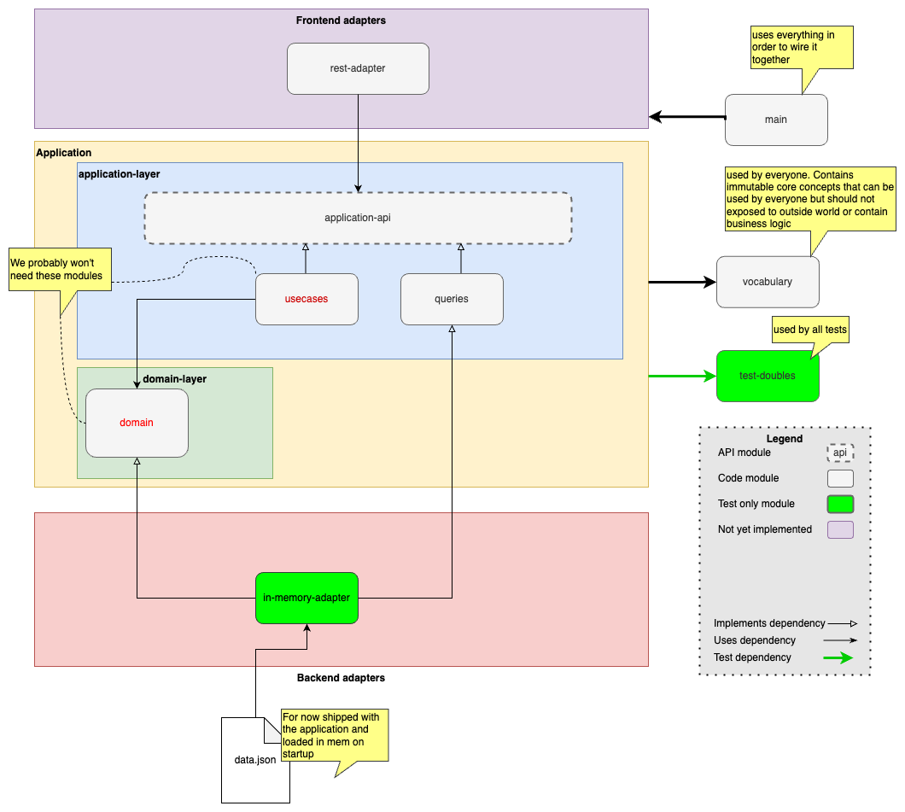

# Application Architecture

## Hexagonal Architecture 

The chosen application architecture is the [hexagonal architecture](hexagonal-architecture.md). We want to seprate the technical aspects from the important logic. We also want to be flexible and to be able  to easily use different adapters. 

For testing purposes there is also an in-memory adapter that can serve as replacement for the adapters.

### Source code setup

|Source Code Module|Layer|Description|
|--- |---|---|
|infra|Infrastructure Layer|The Layer that groups the infra modules |
|front-infra|Frontend infra Layer|Contains front end adapters|
|application|Application Service Layer|The Layer that groups the high level application modules, the outward facing application API, the ports. |
|application-api|Application Service Layer|Module that contains the api for the application|
|usecases|Application Service Layer|Module that contains the usecases. The usecases contain the logic that trigger the domain models |
|queries|Query Layer|Module that contains the read-only queries that return the read models. |
|domain|  The domain| Module for the domain Model, where the behaviour of the application is implemented. Aggregates, repositories go here|
|vocabulary| - |  Module that contains the core concepts of the Bounded Context that do not contain actionable behaviour themselves. be very carefull with this, do not turn it into a garbage bin. Value Objects and domain primitives go here.|
|back-infra|Application Service Layer| The module that contains the backend adapters|

### Module Details

##### Vocabulary 

This module contains immutable core concepts that can be used by everyone but should not exposed to outside world or contain business logic. We decided to let this module also contains events and commands. We could have easily extracted those to a separate module to separate the concepts more clearly. **We are relying on discipline** to use those only where appropriate. Please do not turn this module into a garbage bin, do not misuse commands and events.

## Queries

