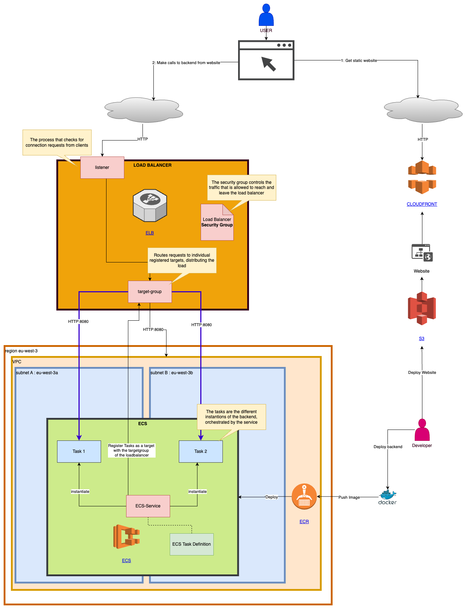

# Deploying the backend on AWS

### Setting up the server infrastructure

You can skip this if the server infrastructure has already been set up. Go immediately to the next section.

If you are setting up the infrastructure for the first time, follow these steps:
- Either follow this heavenly tutorial: https://earthly.dev/blog/deploy-dockcontainers-to-awsecs-using-terraform/
- Or skip it if you understand what all declarations in `deployment/terraform/application.tf` do.)

Both ways use `deployment/terraform/application.tf`. Make sure you fill your AWS access key ID and secret access key in there.
You can start the creation of the infrastructure, command by command from the following file,
or you can just run it all at once with this command:

   ```bash
   cd deployment
   ./runTerraform.sh
   ```

The created app_url is currently wddp-load-balancer-761216200.eu-west-3.elb.amazonaws.com.
You can check this in your `terraform.tfstate`.

After a few seconds, max minutes, test the availability of this backend on the app_url, mentioned above.
For example, with: http://wddp-load-balancer-761216200.eu-west-3.elb.amazonaws.com/plenaries/?page=1&size=10.

And/or if the website (front-end) is already deployed, you can test there in a more visual way whether the backend works.


 

### Deploy

1. Install Docker Desktop

   Also install Docker Desktop [on Mac](https://docs.docker.com/desktop/install/mac-install/), not `brew install docker`!
   See https://github.com/replicate/cog/issues/1382#issuecomment-1869183604.)

  
3. Build the Docker image:

   ```bash
   ./deployment/buildImage.sh
   ```
   + This will do a complete rebuild of the application which will also remove any old cached, projections of the domain model.
   + It will then trigger a regeneration of the domain model caches. You can see these under target/motionCache.json and target/plenaryCache.json. These files will be included in the docker image later on.
   + Then the docker build using the ./Dockerfile will be triggered. This scrpt copy the build jar with the code as well as the domain model cache generated in the previous step.

4. Execute the docker image locally to test if it works:

   ```bash
   ./deployment/runImage.sh
   ```

   Note that the docker image was built for a linux/amd64 platform (with the intention to run it on AWS), it will not match if you run another
   platform (Mac/Windows). You'll get `WARNING: The requested image's platform (linux/amd64) does not match the detected host platform
   (linux/arm64/v8) and no specific platform was requested` and potentially errors that don't occur when running this application locally.

5. Push the docker image to the Elastic Container Registry (ECR) you've just created:

   ```bash
   ./deployment/pushImageToECR.sh
   ```

6. Run terraform again, such that the infrastructure will run a docker container with the new docker image that was just uploaded to the
   Elastic Container Registry (ECR):

   ```bash
   cd deployment
   ./runTerraform.sh
   ```
    Or manually force a new deployment in the AWS console of the ecs service.

7. Test the availability of the backend on the app_url Terraform has created.
   That's currently on http://wddp-load-balancer-761216200.eu-west-3.elb.amazonaws.com/plenaries/?page=1&size=10.

   And/or if the website (front-end) is already deployed, you can test there in a more visual way whether the backend works.
