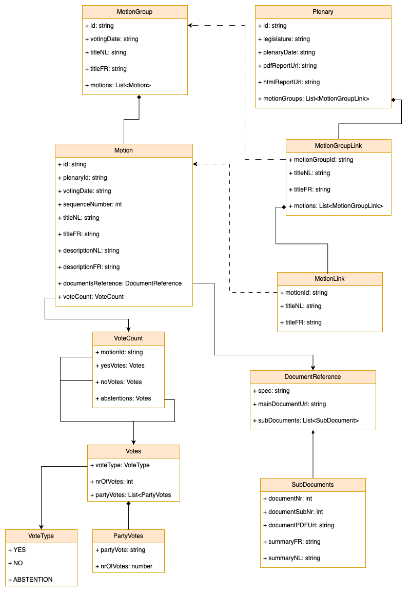

# Different Models

## Different models

Through the application we make use of different models for different purposes. They are related to each other in that they are constructed/mapped from one another.

## Data Model

The model of the [import data](import-data.md) that is delivered ot the backend, contains all the necessary information. This is a contract from the data project, if the data structure changes, the APi is broken.

## Domain Model

The internal representation of the concepts which we are free to use and adapt since it is NOT exposed to the outside world.

## View model

The model that is exposed to the outside world, specifically the front-end, through a REST-api, so that the data can be shown. This is a public contract so any changes here can break the client.

## Model mappings

Below an overview of how the different models relate to each other, how the data gets mapped and eventually visualized.

## Overview

Below an overview of the models and their location in the backend architecture

