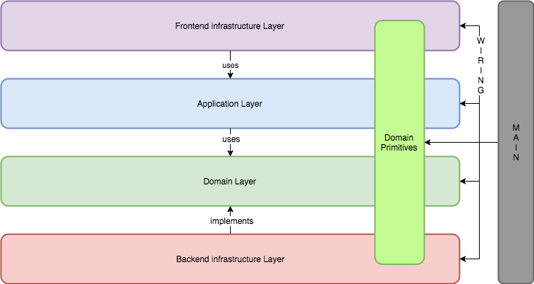
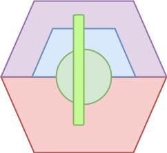

# Application Architecture

### Hexagonal Architecture 

The chosen application architecture is the hexagonal architecture . It would typically represent one Bounded Context.
Here you will find a short explanation of what the hexagonal architecture is. Also named port and adapters or CLean Architecure... 

You can find some more information on it here:

* [Robert Martin Clean Architecture blog post](https://blog.cleancoder.com/uncle-bob/2012/08/13/the-clean-architecture.html)
* [Blog post on port and adapters architecture](https://herbertograca.com/2017/09/14/ports-adapters-architecture/)


#### Definitions	

|Name|Definition|
|--- |---|
|Layer|	A set of modules with a given responsibility
|Module|	A software module
|Flow of control|	The runtime direction of the calls through an application. The stacktrace
|API Module|	A module containing only contract and the necessary data structures. Serves as a separation between modules, Inversion of control.
|Ports|	An abstraction/interface that decouples technical implementation concerns from business functionality
|Adapters|	A module that performs a technical translation/action. It  implements a port or use an API module.


##### Layers

A hexagonal architecture is just a typical layered architecture but with the Dependency Inversion principle applied.

```
High-level modules should not depend on low-level modules. Both should depend on abstractions.

Abstractions should not depend on details. Details should depend on abstractions.

```

The direction of the dependencies arrows is important. 

We use the following layers.

|Layer Name|Definition|
|--- |---|
|Infrastructure Layer|All technical translations, the adapters|
|Frontend infra Layer|The adapters that come first according to the flow of control, above the application layer|
|Backend infra Layer| he adapters that come last according to the flow of control, below the application layer|
|Application Service Layer| The layer where the use case and behaviour of the application resides, high level |
|Domain Layer|  The domain, where the domain is modelled, where the behaviour of the application is implemented. All bussines logic goes here.|




##### Hexagonal representation

The layers of a hexagonal architecture are typical represented as a hexagonal. This to illustrate that all dependencies flow inwards! 



Note that the module vocabulary, that contains the domain primitives, runs through all of the layers. But does not leave the application!

### Modules 

|Module type|Layer|Description|
|--- |---|---|
|application-api|Application Service Layer|The api of the application, that which is visible to the "outside" world. The adapters. It hides all internal details and should be easy to use and self explanatory. The actions here could trigger a process spanning multiple transactions.
|use cases|Application Service Layer|Module that contains the usecases. The use cases contain the delegation logic to invoke operations on the actual domain model. They also are the transactional consistency boundary. Therefore a UseCase should only operate on one Aggregate at a time. An operation from the public application api can trigger a proces that spans multiple use cases. These internal Use cases are not identical to the publica application-api  |
|domain|  The domain| Module for the domain Model, where the behaviour of the application is implemented. Aggregates and their repositories as well as Domain Services go here|
|vocabulary| - |  Module that contains the core concepts of the Bounded Context that do not contain actionable behaviour themselves. Basic concepts that live outside a transactional scope. These concepts live accross layers. Do **NOT** expose them to the outside world. They should not be part of a public api as we want to be able to change the at will.|
  
  


