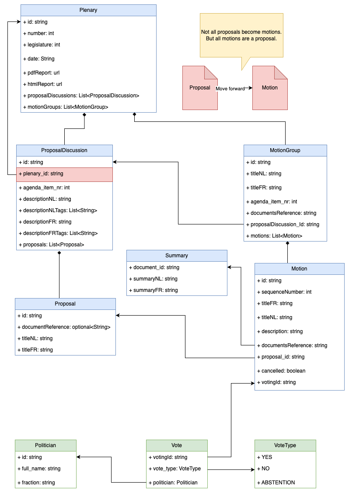

# Ubiquitous Language

An overview of the concepts that are used in the real world and are represented here in the code as well.
[Federal parliament](https://www.senate.be/english/federal_parliament_en.html#T.5.3)

# The data model

The data extracted from the public documents. This does not correspond completely to the internal model of how the information is organised. 

# The concepts

## Plenary

The plenary session is the meeting of the directly elected deputies who sit in the plenary assembly room of
the House.

## Proposal

A proposal is a statement made to the House by a member that the House do something, order something to be done or express an opinion with regard to some matter. A proposal must be phrased in such a way that, if
agreed to, it will purport to express the judgment or will of the House. 

## Motion    

A motion is a **proposal** put forward for debate or decision. A motion must be proposed before any debate or vote can take place in Parliament.

## Vote

A vote is an answer on the question put in a motion.

## Party

A political party is an organization that coordinates candidates to compete in elections. The members of a party typically hold similar ideas about politics, and parties may promote specific ideological or policy goals.

## Politician

An elected representative, often belonging to a political party, who is allowed to vote.